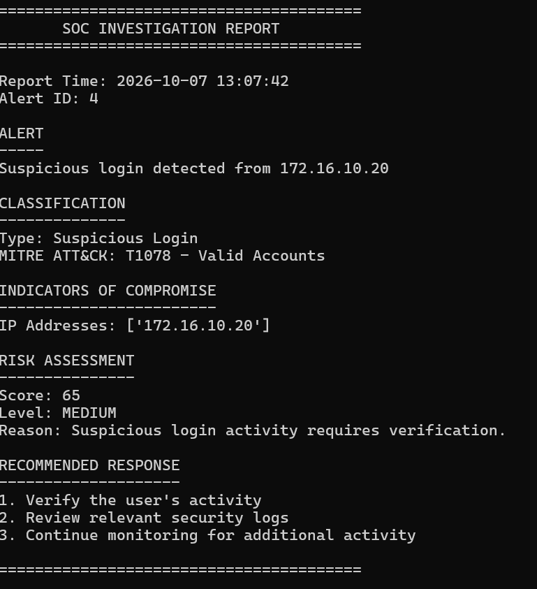
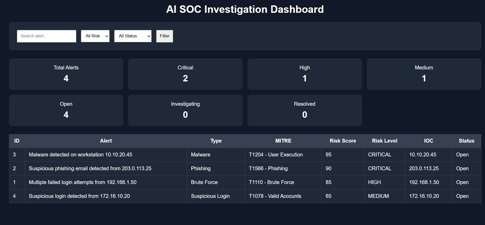
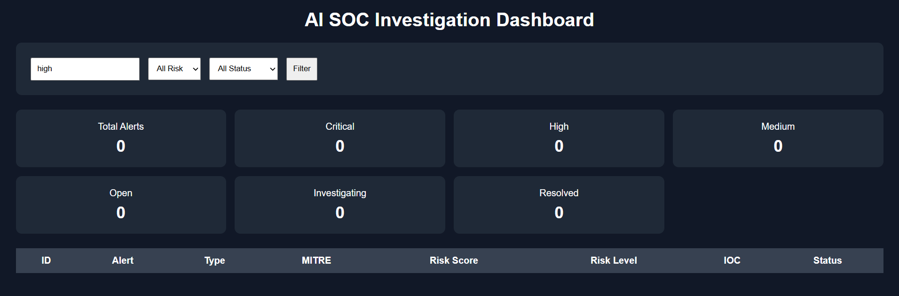
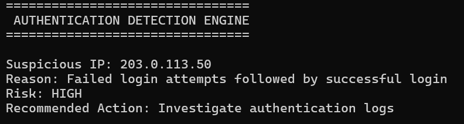

\# AI SOC Investigation Assistant

\## Overview

A Python-based SOC investigation assistant for analyzing security alerts and suspicious authentication activity.

\## Features

\- Security alert classification

\- IOC extraction

\- MITRE ATT\&CK mapping

\- Risk scoring

\- Threat intelligence analysis

\- Authentication log analysis

\- Advanced security event detection

\- Response recommendations

\- Automated investigation reports

\- SQLite alert database

\- Web-based SOC dashboard

\- Alert search and filtering

## Screenshots

### SOC Investigation

### SOC Dashboard

### Dashboard Filtering

### Authentication Detection

\## Technologies

\- Python

\- SQLite

\- JSON

\- Regular Expressions

\- HTTP Server

\- MITRE ATT\&CK concepts

\- Threat Intelligence

\- LLM integration

\## Investigation Workflow

Security Alert

→ Alert Analysis

→ IOC Extraction

→ Threat Intelligence

→ Risk Assessment

→ MITRE ATT\&CK

→ Response Recommendation

→ Investigation

→ Database

→ SOC Dashboard

\## Project Structure

AI-SOC-Assistant/

app/

data/

reports/

database/

\## Future Enhancements

\- Real SIEM integration

\- Windows Event Log integration

\- Real-time alert ingestion

\- Advanced threat hunting

\- Additional threat intelligence sources

